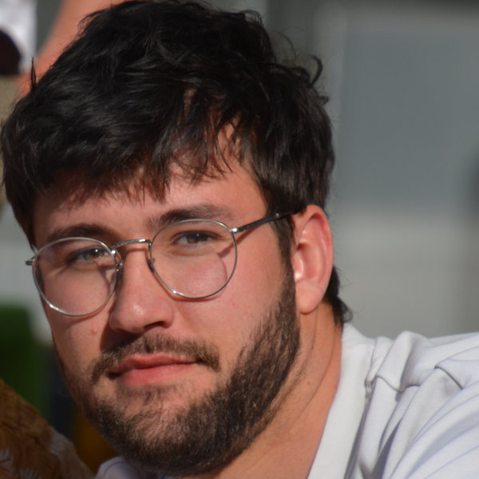

::: hero
{.portrait fig-alt="Portrait de Mario Desallais"}

::: hero-text
[Chercheur en écologie théorique — postdoctorant, Université de Fribourg]{.affil}

::: contact
[Email](mailto:mario.desallais@gmail.com)[·]{.sep}[ORCID](https://orcid.org/0009-0007-3880-592X)[·]{.sep}[Google Scholar](https://scholar.google.com/citations?user=4AH0f-kAAAAJ)[·]{.sep}[GitHub](https://github.com/desallais)
:::

Je suis écologue théoricien. Mon travail revient à peindre le tableau d'un
écosystème pour en étudier les grands principes : comment les espèces
coexistent, ce que la diversité change au fonctionnement d'un écosystème, et
comment tout cela résiste à un climat qui change. Mes outils sont ceux du
théoricien — modèles déterministes, algèbre, géométrie de la faisabilité, et
la simulation en Python — au service d'une théorie assez précise pour être
confrontée aux données. Je travaille au point de rencontre de deux
traditions longtemps séparées : la théorie de la coexistence et la
biodiversité-fonctionnement des écosystèmes.

[→ En savoir plus sur mes recherches](research.html){.more}
:::
:::

## Projets en cours {#current-projects}

- **Coexistence et éco-évolution** — mon postdoc porte officiellement sur la
  coexistence et l'éco-évolution, financé dans le cadre du projet SNSF–NSF
  Lead Agency dirigé par Rudolf P. Rohr (Université de Fribourg), en lien
  avec Serguei Saavedra (MIT).
  [Subside SNSF](https://data.snf.ch/grants/grant/10000467) ·
  [Page de S. Saavedra](https://sites.google.com/site/sergueisaavedra/)
- **Biodiversité et fonctionnement des écosystèmes** — en parallèle, je
  poursuis mes travaux BEF, avec plusieurs études en préparation.
- **Div4Drought (CESAB–FRB)** — je contribue à ce projet collaboratif sur
  diversité et sécheresse.
  [Page du projet](https://www.fondationbiodiversite.fr/la-frb-en-action/programmes-et-projets/le-cesab/div4drought/)
- **Biodiversité, résistance et résilience** — dans le prolongement de mon
  article *Ecology Letters* (2025), je travaille sur ce lien avec une
  approche expérimentale, en collaboration avec la Dre Sarah Gray
  (Bersier Lab, Université de Fribourg).

## Actualités {#news}

- **Décembre 2026** — Je participerai en présentiel au congrès annuel de la
  British Ecological Society, à Birmingham.
- **2025** — Article paru dans *Ecology Letters* : partitionner les effets de
  la biodiversité sur la résistance et la résilience des écosystèmes.
- **2025** — Article paru dans *Oikos* : la distribution des distances au
  bord de la coexistence.
- **Février 2025** — Début de mon contrat postdoctoral à l'Université de
  Fribourg.
