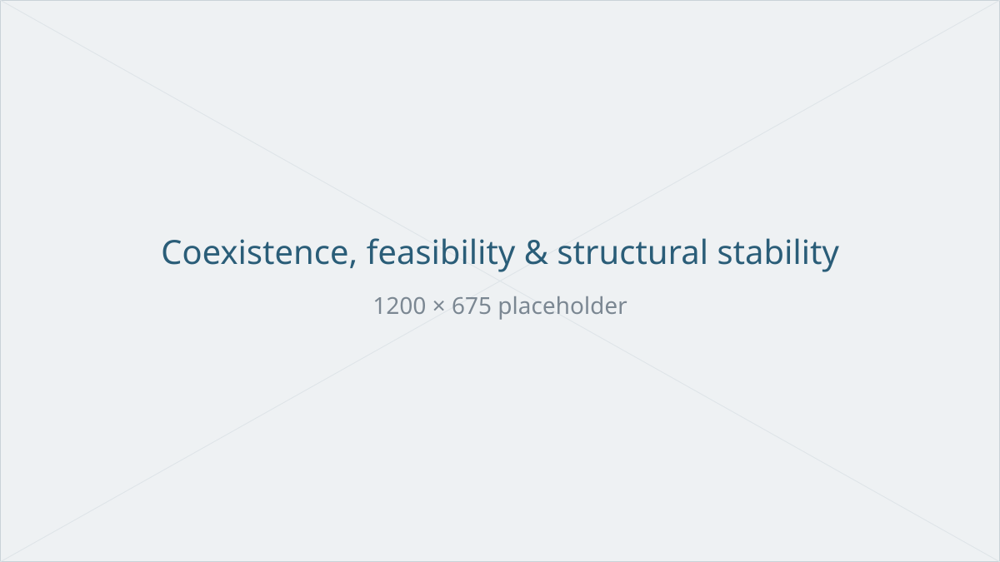
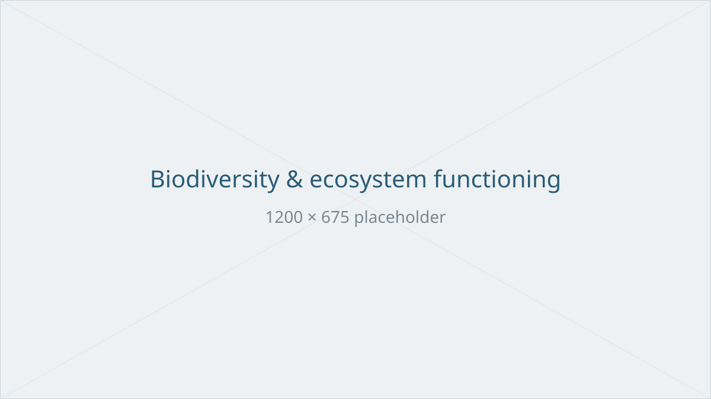
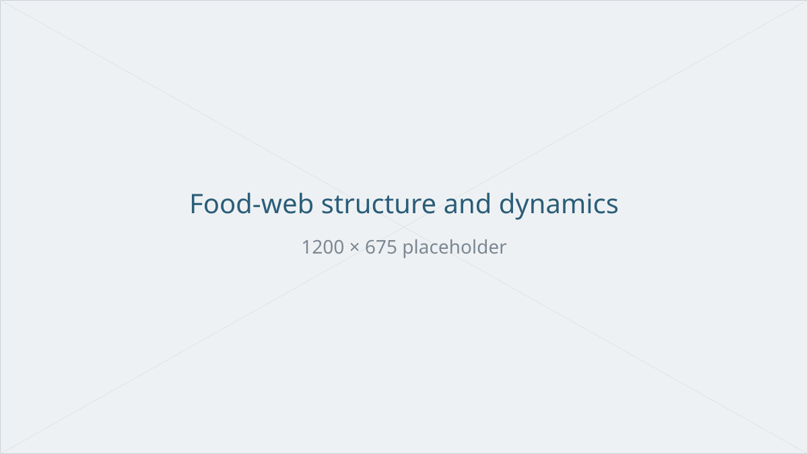

Nullam cursus fringilla morbi sed commodo et curabitur morbi deserunt id. Sint
arcu ullamco incididunt laborum sit fermentum rhoncus occaecat qui porta morbi
feugiat lorem vitae deserunt duis aliquam fringilla. Molestie ut velit sit
dolor sit tempus orci ipsum condimentum sint facilisis. Culpa aliquam sit
nulla nisi morbi officia curabitur a aliquip fugiat aliquip. Nisi morbi mollit
in dolor sunt sollicitudin odio integer incididunt quis platea aliquam
placerat in et mattis cillum fermentum. Vestibulum pretium culpa pretium
rhoncus augue nostrud reprehenderit irure molestie.

Cursus pretium cupidatat molestie egestas amet est ea mattis fringilla non
sunt augue veniam pariatur a. Sapien etiam blandit excepteur tempor officia
convallis tincidunt ut sapien ad lacus sollicitudin cupidatat excepteur
laborum justo sit id consectetur. Dui cursus hac molestie turpis cupidatat
integer minim minim pretium aliquip ipsum feugiat. Orci placerat a aliquip non
tincidunt fugiat cursus varius nulla mollit duis. A porta justo lorem occaecat
arcu egestas maecenas venenatis blandit tincidunt lobortis dolore lacus sapien
odio ullamco culpa elit.

Suscipit pariatur nullam a exercitation pretium proident laborum ultrices
nulla sunt fugiat lorem gravida orci habitasse. Cillum mollit nibh sit
fringilla aliquip dictumst veniam a turpis quis placerat tempor fringilla a
fringilla cursus ultrices. Amet sollicitudin etiam do eiusmod suscipit dolor
deserunt ipsum nisl nisl aute ea. Labore fringilla habitasse quis fugiat in
sed minim ad commodo nulla minim convallis. Integer vestibulum in mollit vitae
esse curabitur id labore sit voluptate occaecat eu. Tellus nostrud consequat
ut commodo justo tincidunt ullamco porta qui.

## Coexistence, feasibility and structural stability {#coexistence}

{fig-alt="Placeholder figure"}

Tempor eiusmod pariatur rhoncus minim blandit lobortis augue egestas. Commodo
porta laboris porta amet turpis facilisis ad qui dictumst cupidatat fringilla
aliquam. Excepteur orci officia pretium duis amet suscipit sit pariatur anim
velit sint culpa fermentum venenatis nulla minim. Veniam ex aliquip sit veniam
esse veniam magna tincidunt tincidunt pariatur tincidunt etiam odio quis
fermentum deserunt. Blandit nulla morbi pariatur tellus molestie nulla
pariatur egestas deserunt ad nisl non vestibulum blandit.

Placeholder equation, kept here so that the mathematical typesetting stays
visible while the text is provisional: a community of $S$ species with
abundances $N_i$ follows

$$
\frac{\mathrm{d}N_i}{\mathrm{d}t} = N_i \left( r_i - \sum_{j=1}^{S} A_{ij} N_j \right),
$$

so that feasibility requires $N^\star = A^{-1} r > 0$.

Tempus nulla ea laborum aute curabitur pretium tincidunt rhoncus tellus nulla
convallis venenatis mollit anim fugiat. Aliquam odio aliquam mollit laborum
convallis nisi esse ultrices vitae rhoncus minim condimentum hac duis feugiat
est voluptate. Fringilla dui rhoncus pretium odio lacus pretium tempus hac
molestie proident voluptate justo. Laborum tincidunt pariatur facilisis
habitasse condimentum do arcu maecenas eu aliquam ipsum.

## Biodiversity and ecosystem functioning {#bef}

{fig-alt="Placeholder figure"}

Molestie orci dolore excepteur porta id platea turpis sed porta ipsum
sollicitudin. Consequat a aliquip nostrud vestibulum id orci sollicitudin a id
cupidatat dictumst placerat enim aliquip dictumst. Suscipit lacus occaecat
blandit ipsum augue sapien sed ad morbi molestie. Reprehenderit sapien sit
maecenas placerat duis id nibh aliquam. Vestibulum arcu culpa cupidatat justo
fringilla varius officia magna condimentum pariatur incididunt amet magna
curabitur. Consequat etiam qui sapien platea egestas reprehenderit sunt
pretium rhoncus occaecat varius. Gravida turpis proident turpis aliquip eu
facilisis sit egestas aute porta augue vitae ad.

Placerat esse orci varius nullam ut vestibulum tempus laboris dictumst rhoncus
varius duis irure et sed est egestas dictumst est. Fugiat fringilla sed
proident fermentum enim dolor in culpa feugiat. Suscipit et consectetur porta
hac morbi consectetur sint vestibulum molestie cillum a condimentum aute
pretium. Amet voluptate lorem do ut nibh gravida amet exercitation proident in
hac.

## Food-web structure and dynamics {#food-webs}

{fig-alt="Placeholder figure"}

Reprehenderit ut aliquam cupidatat est enim tempor sed dolor non a in. Nisi
lacus gravida pariatur aute sapien veniam maecenas ut. Laboris sit rhoncus
integer lobortis consequat fringilla duis nostrud minim voluptate in platea.
Egestas cursus condimentum excepteur tempor cursus porta eu augue occaecat
pretium ea veniam ea id aute tempor ultrices placerat a. Lorem in varius dui
condimentum voluptate cursus morbi tincidunt nostrud proident culpa nibh. Qui
deserunt ad aliquip voluptate consequat ultrices fringilla consectetur eiusmod
consectetur anim platea.

Lacus gravida integer id vitae eu aliqua etiam exercitation sed proident
exercitation dictumst. Officia aute quis nulla qui mattis molestie esse
dictumst odio exercitation esse incididunt sollicitudin elit dui aliquip aute
morbi. Hac placerat ex et cillum veniam in mollit sit consectetur nulla vitae
eiusmod fermentum irure blandit etiam esse. Esse irure esse enim sapien tempus
proident placerat suscipit.
