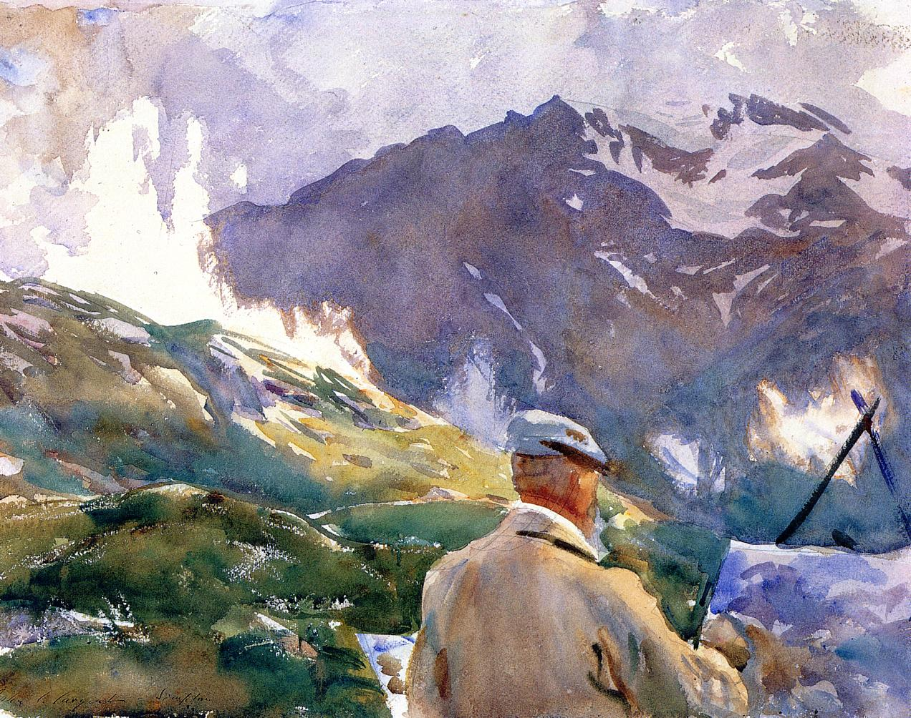
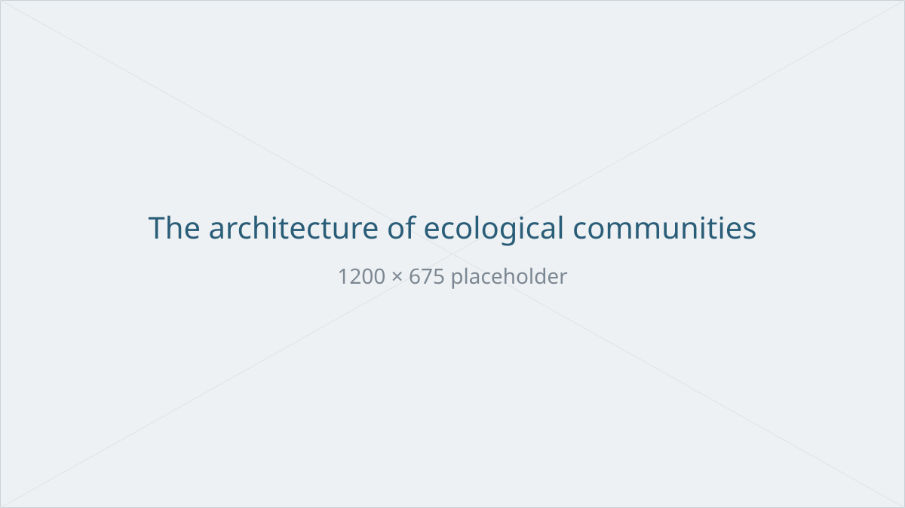
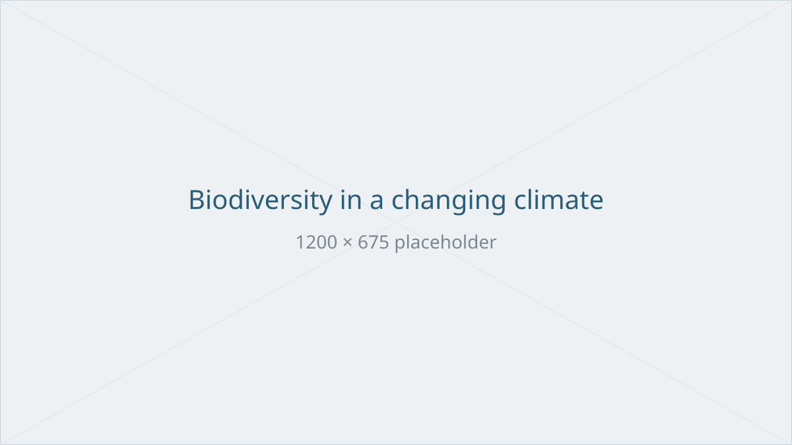

My research in ecology amounts to painting a picture of an ecosystem
(imagine a teeming forest in the distance) and simply studying the
picture. It is simpler, more practical; the conclusions are coarser,
sometimes wrong. But at least it can be done from the easel —
repainting the canvas as many times as it takes, changing a colour,
removing a tree and watching what collapses. Only, my canvas is
sometimes a whiteboard covered in equations, sometimes a computer
screen in the middle of a calculation, sometimes an arrow diagram
scribbled on a corner of scrap paper.

{fig-alt="Watercolour by John Singer Sargent: a painter seen from behind, painting an Alpine landscape." fig-align="center" width="650"}

What interests me, then, are the broad principles — the rules that
emerge from ecosystems, or that shape them: how do several species
manage to coexist, and at what point do they end up excluding one
another? How does the number of species influence an ecosystem — and
is more always better?

There is nothing new about these two questions: they are, in short,
the themes of coexistence theory and of biodiversity–ecosystem
functioning (BEF), of which I am one of the humble descendants. Two
traditions that long ignored each other — and whose meeting is, to my
eyes, one of the most exciting frontiers of the discipline. That is
where I have set up my easel.

The sections below sketch how I see each of these fronts — where the
field has come from, and where I believe it should go. If these
questions resonate with you — for an internship, a PhD, or a
collaboration — my door is open.

## The architecture of ecological communities {#architecture}

{fig-alt="Placeholder figure"}

Fifty years ago, Robert May asked whether a large complex system would be
stable, and answered: in general, no. Ever since, community ecology has
been working out what is special about the interaction networks that
nature does assemble. The last decade gave this old question a geometric
turn I find particularly elegant: the environmental conditions allowing
all species of a community to coexist form a domain whose size and shape
are carved by the interaction network — turning "how likely is
coexistence, and how fragile?" into something one can actually compute
([Rohr et al. 2014](https://doi.org/10.1126/science.1253497) remains, for
me, a landmark of this school).

What I expect from the coming years is a unification. Coexistence and
functioning are still mostly treated as separate properties of the same
communities; yet the signs are accumulating that they constrain each
other deeply — that what a community yields carries information about
whether it can persist. Making this link general, and extending it beyond
single-trophic-level communities into food webs — where even the notion
of a monoculture baseline dissolves — is, to my eyes, among the most
promising programmes in community ecology.

## Mathematics as a microscope {#mathematics-microscope}

{fig-alt="Placeholder figure"}

Theoretical ecology has a long tradition of small models with large
consequences: Lotka's and Volterra's equations, MacArthur's consumers and
resources, May's random matrices, Chesson's coexistence framework, the
Loreau–Hector partition. None of these were meant as portraits of nature.
They are instruments — built to isolate one mechanism and make it
visible. That is the tradition I work in, and the one I want to defend in
an era rich in data and simulation: a differential equation is a
statement of mechanism, and what can be derived from it exactly holds
with the force of logic rather than the contingency of a parameter sweep.

Concretely, my toolbox is that of dynamical systems applied to ecology:
Lotka–Volterra and resource-competition models, linear algebra and the
geometry of feasibility, stability metrics from asymptotic to transient,
exact partitions of biodiversity effects — with Python simulation to
verify, to explore, and to meet the data. The theory I find worth writing
is theory a field ecologist can use without redoing the mathematics.

## Biodiversity in a changing climate {#biodiversity-climate}

{fig-alt="Placeholder figure"}

Does diversity stabilise ecosystems? The question is as old as the
discipline — Elton's intuition, May's counterexample — and the insurance
hypothesis gave it its modern form: diversity buffers ecosystems because
different species respond differently to environmental fluctuations
([Yachi & Loreau 1999](https://doi.org/10.1073/pnas.96.4.1463) remains, to
me, a model of what simple theory can achieve). Experiments have since
made the stakes concrete: in grasslands, diversity can increase the
resistance of productivity to climate extremes
([Isbell et al. 2015](https://doi.org/10.1038/nature15374)). Yet the
empirical record on resistance and resilience remains strikingly mixed —
and I read this not as a failure of the idea, but as a sign that we still
lack the theory to know what to measure, and how to decompose what we
observe.

This is where I see the field's most urgent frontier: stability-oriented
BEF theory precise enough to be confronted with experiments — in
grasslands, and increasingly in the international networks of
tree-diversity experiments, where climate extremes will matter most. The
ambition, as I see it: turning "biodiversity as insurance" from a
metaphor into a quantitative, mechanistic statement.
